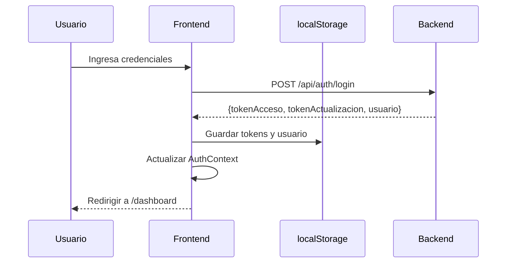
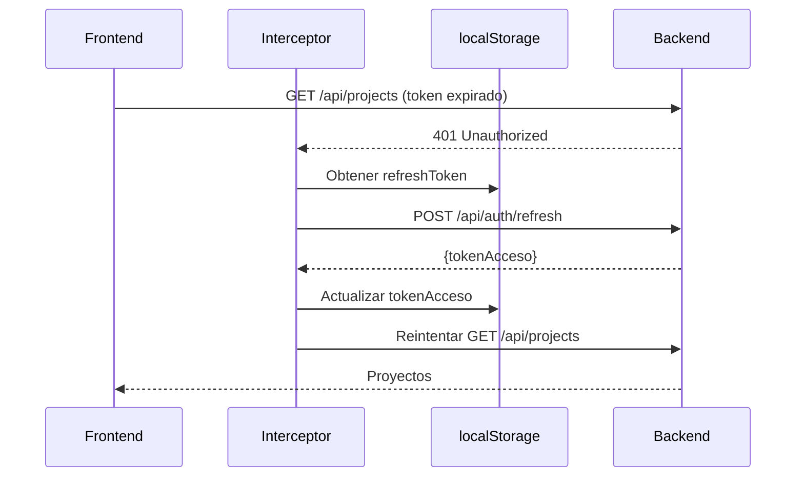
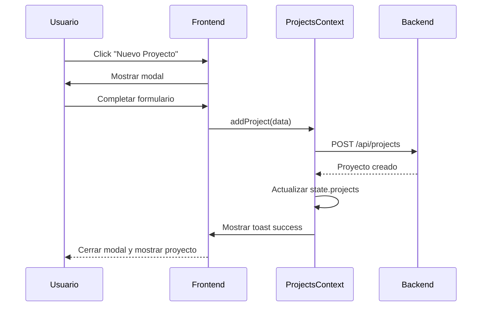
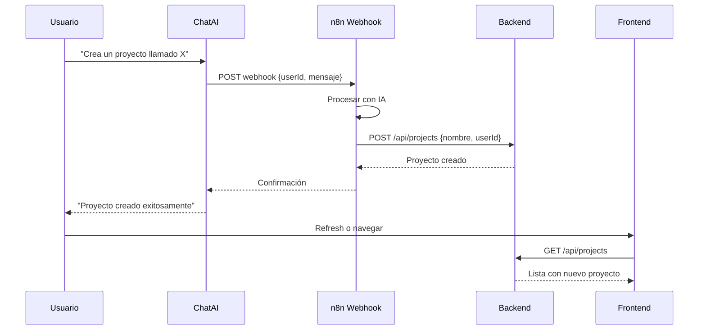
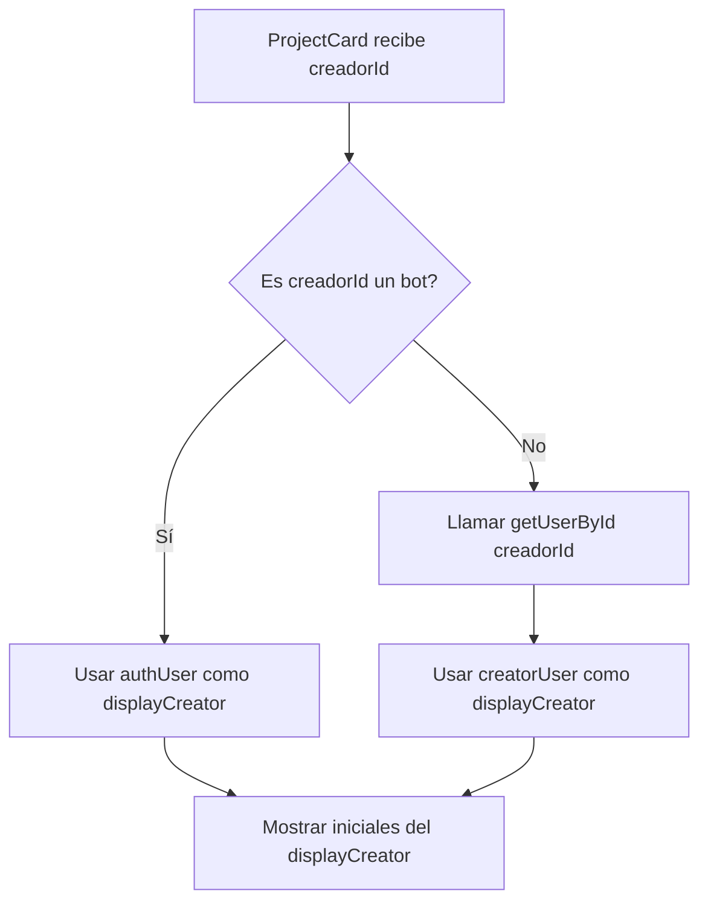

# WorkLyst Frontend - Product Requirements Document (PRD)

## 1. Visión General del Producto

WorkLyst es una plataforma moderna de gestión de proyectos que permite a equipos organizar, colaborar y dar seguimiento a sus proyectos de manera eficiente. El frontend proporciona una interfaz intuitiva y responsiva que se conecta con un backend RESTful API.

---

## 2. Objetivos del Frontend

- Proporcionar una experiencia de usuario fluida y moderna
- Gestionar autenticación segura con persistencia de sesión
- Permitir creación y gestión de proyectos de forma visual
- Integrar asistente IA para creación de proyectos mediante lenguaje natural
- Mantener sincronización en tiempo real con el backend
- Garantizar responsividad en todos los dispositivos

---

## 3. Arquitectura Técnica

### 3.1 Stack Tecnológico

| Tecnología   | Versión | Propósito               |
| ------------ | ------- | ----------------------- |
| React        | 19      | Librería UI principal   |
| Vite         | Latest  | Build tool y dev server |
| Tailwind CSS | 4       | Framework de estilos    |
| React Router | 7       | Enrutamiento            |
| Axios        | Latest  | Cliente HTTP            |
| n8n Chat     | Latest  | Widget de chat IA       |

### 3.2 Gestión de Estado

El frontend utiliza **React Context API** para gestión de estado global, organizado en 4 contextos principales:

#### AuthContext

**Responsabilidad:** Autenticación y gestión de sesión

**Estado:**

```javascript
{
  user: {
    id: string,
    nombre: string,
    email: string,
    iniciales: string
  } | null,
  loading: boolean,
  success: boolean,
  error: string | null
}
```

**Acciones:**

- `register(userData)` - Registrar nuevo usuario
- `login(userData)` - Iniciar sesión
- `logout()` - Cerrar sesión

**Persistencia:**

- `localStorage.tokenAcceso` - JWT access token
- `localStorage.tokenActualizacion` - JWT refresh token
- `localStorage.usuario` - Datos del usuario (JSON)

#### ProjectsContext

**Responsabilidad:** Gestión de proyectos

**Estado:**

```javascript
{
  projects: Array<Project>,
  project: Project | null,
  state: {
    loading: boolean,
    error: string | null,
    success: boolean
  }
}
```

**Acciones:**

- `getProjects()` - Obtener todos los proyectos
- `getProjectById(id)` - Obtener proyecto específico
- `addProject(projectData)` - Crear nuevo proyecto

#### UsersContext

**Responsabilidad:** Búsqueda y obtención de usuarios

**Estado:**

```javascript
{
  user: User | null,
  loading: boolean,
  error: string | null
}
```

**Acciones:**

- `searchUsers(query)` - Buscar usuarios por nombre
- `getUserById(id)` - Obtener usuario por ID

**Características especiales:**

- Detecta usuarios bot y devuelve datos estáticos
- Filtra bots de resultados de búsqueda

#### ToastContext

**Responsabilidad:** Sistema de notificaciones

**Acciones:**

- `addToast(message, type)` - Mostrar notificación
  - Tipos: "success", "error", "info"

---

## 4. Integración con Backend API

### 4.1 Cliente HTTP (lib/api.js)

**Configuración:**

```javascript
const api = axios.create({
  baseURL: import.meta.env.VITE_API_URL,
});
```

**Request Interceptor:**

- Añade `Authorization: Bearer <token>` a todas las peticiones
- Lee token de `localStorage.tokenAcceso`

**Response Interceptor:**

- Detecta errores 401 (token expirado)
- Llama automáticamente a `/api/auth/refresh`
- Actualiza token en localStorage
- Reintenta petición original
- Redirige a login si refresh falla

### 4.2 Endpoints API

#### Autenticación

**POST /api/auth/register**

```javascript
Request: {
  nombre: string,
  email: string,
  password: string
}

Response: {
  usuario: User,
  tokenAcceso: string,
  tokenActualizacion: string
}
```

**POST /api/auth/login**

```javascript
Request: {
  email: string,
  password: string
}

Response: {
  usuario: User,
  tokenAcceso: string,
  tokenActualizacion: string
}
```

**POST /api/auth/logout**

```javascript
Request: {
  tokenActualizacion: string;
}

Response: {
  message: string;
}
```

**POST /api/auth/refresh**

```javascript
Request: {
  tokenActualizacion: string;
}

Response: {
  tokenAcceso: string;
}
```

#### Proyectos

**GET /api/projects**

```javascript
Headers: {
  Authorization: "Bearer <token>"
}

Response: Array<{
  id: string,
  nombre: string,
  descripcion: string,
  status: "En Progreso" | "Completado",
  creadorId: string,
  miembros: Array<User>,
  creadoEn: string,
  actualizadoEn: string
}>
```

**GET /api/projects/:id**

```javascript
Headers: {
  Authorization: "Bearer <token>"
}

Response: {
  id: string,
  nombre: string,
  descripcion: string,
  status: string,
  tareas: Array<Task>,
  miembros: Array<User>,
  creadorId: string,
  creadoEn: string,
  actualizadoEn: string
}
```

**POST /api/projects**

```javascript
Headers: {
  Authorization: "Bearer <token>"
}

Request: {
  nombre: string,
  descripcion: string,
  status: string
}

Response: Project
```

#### Usuarios

**GET /api/users?nombre=<query>**

```javascript
Headers: {
  Authorization: "Bearer <token>"
}

Response: Array<{
  id: string,
  nombre: string,
  email: string,
  iniciales: string
}>
```

**GET /api/users/:id**

```javascript
Headers: {
  Authorization: "Bearer <token>"
}

Response: {
  id: string,
  nombre: string,
  email: string,
  iniciales: string
}
```

---

## 5. Flujos de Usuario

### 5.1 Flujo de Autenticación



### 5.2 Flujo de Refresh Token



### 5.3 Flujo de Creación de Proyecto

**Manual:**



**Via ChatAI:**



### 5.4 Flujo de Detección de Bot Creator



---

## 6. Componentes Principales

### 6.1 Páginas (src/pages/)

| Página        | Ruta            | Descripción         | Protegida |
| ------------- | --------------- | ------------------- | --------- |
| Login         | `/login`        | Inicio de sesión    | No        |
| Register      | `/register`     | Registro de usuario | No        |
| Dashboard     | `/dashboard`    | Panel principal     | Sí        |
| Projects      | `/projects`     | Lista de proyectos  | Sí        |
| ProjectDetail | `/projects/:id` | Detalle con Kanban  | Sí        |
| Community     | `/community`    | Comunidad (WIP)     | Sí        |

### 6.2 Componentes de Proyecto

**ProjectCard**

- Muestra información resumida del proyecto
- Avatares de miembros (máx 4 visibles)
- Detección inteligente de bot creator
- Link a detalle del proyecto

**ProjectModal**

- Formulario de creación de proyecto
- Validación de campos
- Integración con ProjectsContext

**ProjectStats**

- Estadísticas de proyectos
- Total, en progreso, completados

**KanbanBoard**

- Tablero drag-and-drop
- Tres columnas: Por hacer, En progreso, Completado
- Persistencia en localStorage

### 6.3 Componentes de Layout

**Header**

- Logo y navegación
- Menú de usuario
- Responsive (hamburger en móvil)

**ProtectedRoute**

- Verifica autenticación
- Redirige a login si no autenticado

### 6.4 Componentes de IA

**ChatAI**

- Widget de chat integrado
- Envía userId en metadata
- Conexión con n8n webhook

---

## 7. Características Especiales

### 7.1 Detección de Usuario Bot

**Problema:** n8n puede crear proyectos con "IA System Bot" como creador

**Solución:**

1. `UsersContext.getUserById()` detecta IDs de bot
2. Devuelve datos estáticos en lugar de llamar API
3. `ProjectCard` usa usuario autenticado como displayCreator
4. UI muestra iniciales del usuario real, no del bot

**IDs de Bot detectados:**

- "IA System Bot"
- "ia-system-bot"
- "IA_SYSTEM_BOT"

### 7.2 Persistencia de Sesión

**Implementación:**

1. Login guarda tokens y usuario en localStorage
2. `AuthContext` restaura sesión al montar
3. Interceptor usa token en todas las peticiones
4. Refresh automático en caso de expiración

**Datos persistidos:**

- `tokenAcceso` - JWT access token
- `tokenActualizacion` - JWT refresh token
- `usuario` - Objeto usuario (JSON)

### 7.3 Sistema de Toasts

**Características:**

- Notificaciones no intrusivas
- Tipos: success, error, info
- Auto-dismiss después de 3 segundos
- Animaciones suaves

---

## 8. Variables de Entorno

```env
VITE_API_URL=http://localhost:3000
```

**Uso:**

- Base URL para todas las peticiones API
- Configurado en `lib/api.js`
- Accesible via `import.meta.env.VITE_API_URL`

---

## 9. Seguridad

### 9.1 Autenticación

- JWT tokens almacenados en localStorage
- Access token de corta duración
- Refresh token de larga duración
- Refresh automático transparente

### 9.2 Autorización

- Todas las rutas protegidas requieren autenticación
- Token enviado en header Authorization
- Backend valida token en cada petición

### 9.3 Validación

- Validación de formularios en frontend
- Sanitización de entrada de usuario
- Manejo de errores del backend

---

## 10. Rendimiento

### 10.1 Optimizaciones

- Code splitting por rutas
- Lazy loading de componentes
- Vite para build optimizado
- Tailwind CSS purge en producción

### 10.2 Caching

- localStorage para sesión de usuario
- Context API para estado global
- Evita re-fetching innecesario

---

## 11. Accesibilidad

- Etiquetas ARIA en componentes interactivos
- Navegación por teclado
- Contraste de colores WCAG AA
- Semantic HTML

---

## 12. Testing (Recomendado)

### 12.1 Unit Tests

- Componentes individuales
- Context providers
- Utilidades y helpers

### 12.2 Integration Tests

- Flujos de autenticación
- Creación de proyectos
- Navegación entre páginas

### 12.3 E2E Tests

- Flujo completo de usuario
- Cypress o Playwright recomendado

---

## 13. Roadmap Futuro

- [ ] Tests automatizados
- [ ] PWA support
- [ ] Notificaciones push
- [ ] Modo offline
- [ ] Colaboración en tiempo real (WebSockets)
- [ ] Temas personalizables
- [ ] Internacionalización (i18n)

---

**Versión:** 1.0  
**Última actualización:** 2026-01-27  
**Desarrollado para:** Uneti Grupo
